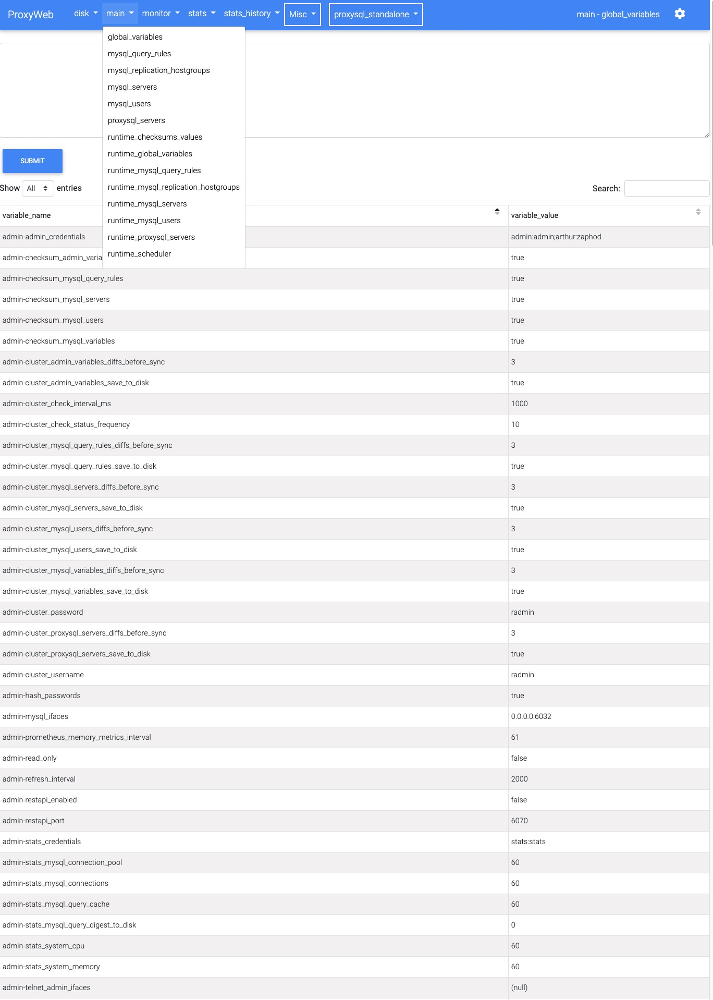

# ProxyWeb
Open Source Web UI for [ProxySQL](https://proxysql.com/)

## Table of Contents

- [Introduction](#introduction)
- [Features](#features)
- [Setup](#setup)
  - [Install ProxyWeb next to ProxySQL](#install-proxyweb-next-to-proxysql)
  - [Install it as a systemd service (Ubuntu)](#install-it-as-a-systemd-service-ubuntu)
  - [Install ProxyWeb to work with remote ProxySQL servers](#install-proxyweb-to-work-with-remote-proxysql-servers)




## Introduction
ProxyWeb is a modern, lightweight web-based interface for ProxySQL, the popular high-performance MySQL proxy. Designed for simplicity and full control, ProxyWeb allows administrators to manage ProxySQL servers, users, query rules, and variables—all through an intuitive web UI.

## Features:
- Clean and responsive design
- [Multi-server support](misc/images/ProxyWeb_servers.jpg)
- [Configurable reporting](misc/images/ProxyWeb_report.jpg)
- Global and per-server options
- Hide unused tables (global or per-server basis)
- Sort content by any column (asc/desc)
- Online config editor
- Narrow-down content search
- Paginate content
- Command history and SQL dropdown menu 
- Adhoc MySQL queries
- Basic authentication


# Setup

## Prerequisites

- Docker installed on your system
- Git installed
- Basic understanding of ProxySQL and MySQL

## Install ProxyWeb next to ProxySQL
With Docker:
```
docker run -h proxyweb --name proxyweb --network="host" -d proxyweb/proxyweb:latest
```
## Install it as a systemd service (Ubuntu)
```
git clone https://github.com/miklos-szel/proxyweb
cd proxyweb
make install
```
Visit  [http://ip_of_the_host:5000/setting/edit](http://ip_of_the_host:5000/setting/edit) first and adjust the credentials if needed.
The default connection is the local one with the default credentials.


## Install ProxyWeb to work with remote ProxySQL servers
### Configure ProxySQL for remote admin access

ProxySQL only allows local admin connections by default.

In order to enable remote connections you have to enable it in ProxySQL:

```
set admin-admin_credentials="admin:admin;radmin:radmin";
load admin variables to runtime; save admin variables to disk;
```

After this we can connect to the ProxySQL with:
- username: radmin
- password: radmin
- port: 6032 (default)

Run:
```
docker run -h proxyweb --name proxyweb -p 5000:5000 -d proxyweb/proxyweb:latest
```

Visit [http://ip_of_the_host:5000/setting/edit](http://ip_of_the_host:5000/setting/edit) first and edit the `servers`
section.

> [!NOTE]  
> Basic authentication is turned on by default in the latest version, default credentials are as follows:
>
> - username: admin 
>
> - password: admin42
> 
> These can be changed by editing the config file.

## Environment Variable Overrides
You can override sensitive values from `config/config.yml` without editing the file by setting environment variables before starting ProxyWeb.

- Web UI credentials:
  - `PROXYWEB_ADMIN_USER` – overrides `auth.admin_user`
  - `PROXYWEB_ADMIN_PASSWORD` – overrides `auth.admin_password`
- ProxySQL server DSN values (per server, using the server key from the config):
  - `PROXYWEB_SERVER_<SERVERNAME>_USER`
  - `PROXYWEB_SERVER_<SERVERNAME>_PASSWORD`
  - `PROXYWEB_SERVER_<SERVERNAME>_HOST`
  - `PROXYWEB_SERVER_<SERVERNAME>_PORT`
  - `PROXYWEB_SERVER_<SERVERNAME>_DATABASE`

For example, to override the credentials for the default `proxysql` server:
```
export PROXYWEB_SERVER_PROXYSQL_USER=myuser
export PROXYWEB_SERVER_PROXYSQL_PASSWORD=mypassword
```

Multiple `dsn` entries share the same overrides for the specified server key.


---

### Features on the roadmap
- ability to edit tables
- better input validation

---
### Credits:

- Thanks for René Cannaò and the SysOwn team  [ProxySQL](https://proxysql.com/).
- Tripolszky 'Tripy' Zsolt


