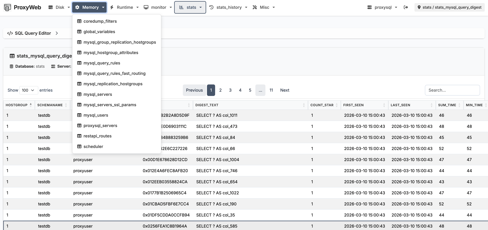
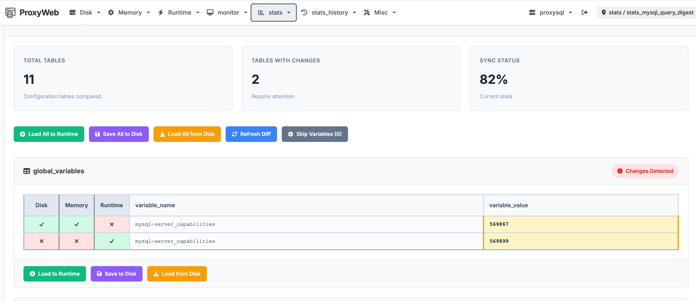
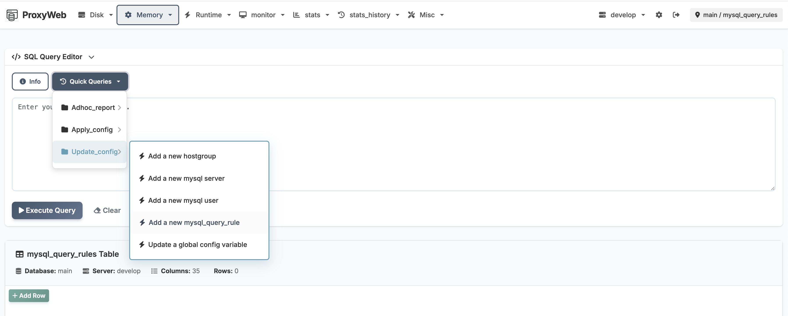

# ProxyWeb

A modern, open-source web UI for managing [ProxySQL](https://proxysql.com/) servers.



## Overview

ProxyWeb gives you full control over ProxySQL through a clean web interface — browse tables, edit rows inline, run SQL queries, compare configurations across layers, and manage multiple ProxySQL instances from a single dashboard.

## Features

- **Multi-server management** — switch between ProxySQL instances from the nav bar
- **Table browser** — view, search, sort, and paginate any ProxySQL table
- **Inline editing** — insert, update, and delete rows directly in the browser
- **SQL query editor** — run ad-hoc queries with quick-query shortcuts for common operations
- **Query history** — persistent per-server history with dropdown recall and full history page
- **Config diff** — compare Disk / Memory / Runtime layers side by side, spot drift instantly
- **Role-based access** — admin and read-only users with separate credentials
- **Environment variable overrides** — inject credentials and DSN settings without editing files
- **Settings UI** — edit `config.yml` through a structured form or raw YAML editor
- **Hide tables** — filter out unused tables globally or per server
- **Configurable reports** — define reusable SQL reports in config
- **Docker and systemd** — run as a container or install as a native service

| Config diff view | SQL editor with quick queries |
|:---:|:---:|
|  |  |

## Quick Start

```bash
docker run -h proxyweb --name proxyweb -p 5000:5000 -d proxyweb/proxyweb:latest
```

Then open `http://<host>:5000` and log in with the default credentials (`admin` / `admin42`).

> [!IMPORTANT]
> ProxySQL's admin port (default **6032**) must be reachable from the ProxyWeb container. Configure the connection in Settings after first login.
>
> [!NOTE]
> The login page shows a hint when default credentials are still in use.
> Change them in Settings or via environment variables after first login.

## Setup

### Prerequisites

- Docker (or Python 3 + pip for bare-metal)
- A running ProxySQL instance with admin interface enabled

### Docker

```bash
docker run -h proxyweb --name proxyweb -p 5000:5000 -d proxyweb/proxyweb:latest
```

After starting, visit `/settings/edit/` to configure your ProxySQL server connection.

> [!NOTE]
> If ProxyWeb runs on the same host as ProxySQL you can use `--network="host"` instead of `-p 5000:5000`.

### Building from source

```bash
make proxyweb-build                        # linux/amd64, tag: latest
make proxyweb-build PLATFORM=linux/arm64   # cross-compile for ARM
make proxyweb-build TAG=1.2.3              # custom tag
```

| Variable   | Default       | Description                                              |
|------------|---------------|----------------------------------------------------------|
| `PLATFORM` | `linux/amd64` | Target architecture passed to `docker build --platform`  |
| `TAG`      | `latest`      | Docker image tag (`proxyweb/proxyweb:<TAG>`)             |

### Systemd service (Ubuntu)

```bash
git clone https://github.com/miklos-szel/proxyweb
cd proxyweb
make install
```

Visit `http://<host>:5000/settings/edit/` to configure the server connection.

### Remote ProxySQL access

ProxySQL only allows local admin connections by default. To enable remote access:

```sql
SET admin-admin_credentials="admin:admin;radmin:radmin";
LOAD ADMIN VARIABLES TO RUNTIME;
SAVE ADMIN VARIABLES TO DISK;
```

Then configure ProxyWeb with `host`, `user: radmin`, `passwd: radmin`, `port: 6032`.

## Configuration

### Default credentials

| Role      | Username   | Password     |
|-----------|------------|--------------|
| Admin     | `admin`    | `admin42`    |
| Read-only | `readonly` | `readonly42` |

### Environment variable overrides

Override sensitive values from `config/config.yml` without editing the file.

**Web UI credentials:**

| Variable                     | Overrides              |
|------------------------------|------------------------|
| `PROXYWEB_ADMIN_USER`        | `auth.admin_user`      |
| `PROXYWEB_ADMIN_PASSWORD`    | `auth.admin_password`  |
| `PROXYWEB_READONLY_USER`     | `auth.readonly_user`   |
| `PROXYWEB_READONLY_PASSWORD` | `auth.readonly_password` |

**Per-server DSN** (replace `<SERVERNAME>` with the uppercase server key from config):

| Variable                                | Overrides    |
|-----------------------------------------|--------------|
| `PROXYWEB_SERVER_<SERVERNAME>_USER`     | DSN `user`   |
| `PROXYWEB_SERVER_<SERVERNAME>_PASSWORD` | DSN `passwd` |
| `PROXYWEB_SERVER_<SERVERNAME>_HOST`     | DSN `host`   |
| `PROXYWEB_SERVER_<SERVERNAME>_PORT`     | DSN `port`   |
| `PROXYWEB_SERVER_<SERVERNAME>_DATABASE` | DSN `db`     |

Example:
```bash
export PROXYWEB_SERVER_PROXYSQL_USER=myuser
export PROXYWEB_SERVER_PROXYSQL_PASSWORD=mypassword
```

When running in Docker, place variables in a `.env` file mounted at `/app/.env` (or set `PROXYWEB_ENV_FILE` to a custom path). The entrypoint loads it automatically before startup.

## Credits

- René Cannaò and the SysOwn team for [ProxySQL](https://proxysql.com/)
- Tripolszky 'Tripy' Zsolt
